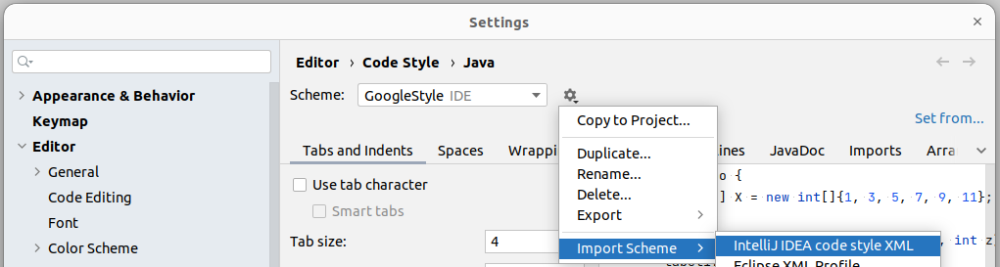

# java-code-style

A fork from Google's Java codestyle with a couple of modifications.

### Modifications
- [x] 4 spaces indentation instead of 2
- [x] 120 characters line length instead of 100
- [x] Imports before static imports

### Usage
- Clone this repo or download raw [GoogleStyle.xml](https://github.com/barakatech/java-code-style/blob/main/GoogleStyle.xml)
- Go to `Settings > Editor > Code Style > Java`
- Click on the gear icon and select `Import Scheme > IntelliJ IDEA code style XML`

### TODO
- [ ] Add codestyle for other IDEs